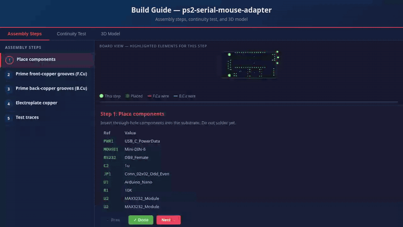
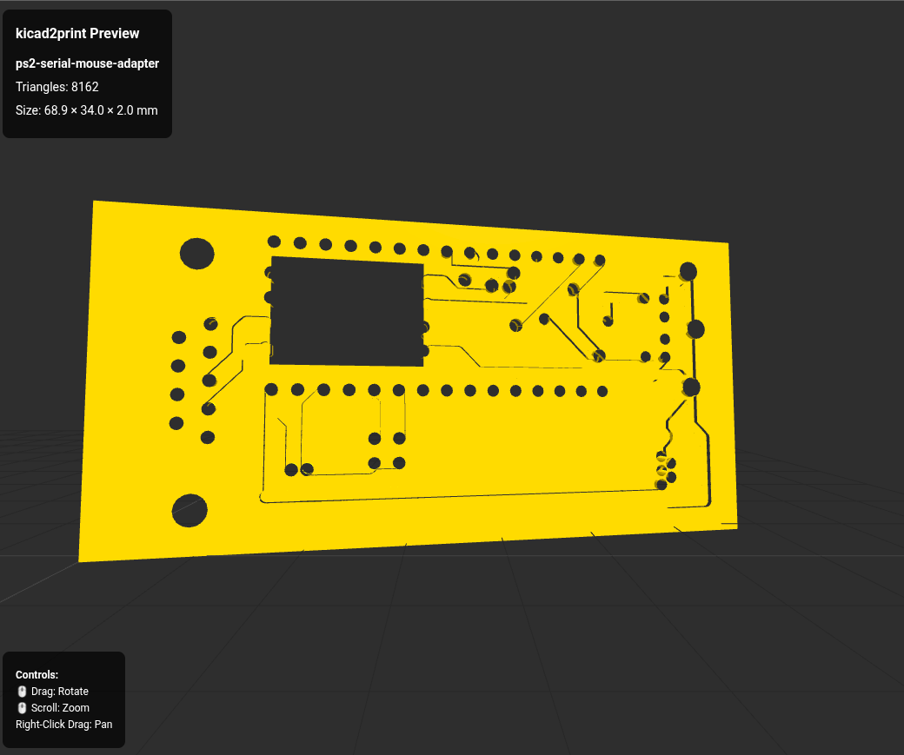
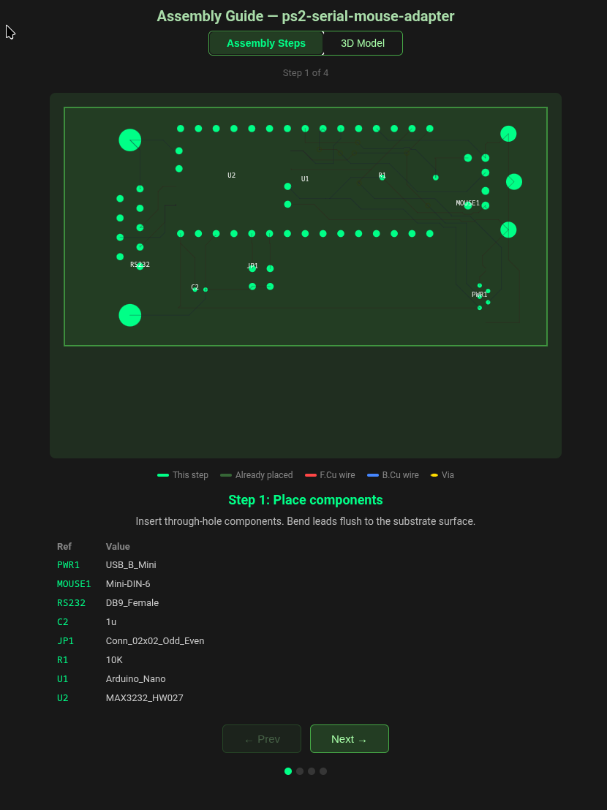

# kicad2print

Convert KiCad PCB designs into 3D-printable substrate models for the **hybrid PCB** construction method — a technique that replaces traditional PCB fabrication with a 3D-printed substrate and copper traces, using either laid copper wire or electroplated copper.

[](https://github.com/N0t4R0b0t/kicad2print/actions/workflows/release.yml)

<p align="center">
  
  <br/>
  <em>The generated build guide: assembly steps, an interactive continuity test that pulses probe dots on every pad of the selected net, and an embedded 3D model — all in one self-contained HTML file.</em>
</p>

| 3D Substrate Preview | Assembly Guide |
|:---:|:---:|
| [](https://github.com/N0t4R0b0t/kicad2print/blob/master/examples/ps2-serial-mouse-adapter/ps2-serial-mouse-adapter.stl) | [](https://github.com/N0t4R0b0t/kicad2print/blob/master/examples/ps2-serial-mouse-adapter/preview.png) |

*Example: [ps2-serial-mouse-adapter](https://github.com/N0t4R0b0t/ps2-serial-mouse-adapter) — a fork of [necroware/ps2-serial-mouse-adapter](https://github.com/necroware/ps2-serial-mouse-adapter). Substrate preview links to the interactive 3D viewer.*

---

## What is the hybrid PCB method?

Instead of sending your board to a fab house, you print the substrate on an FDM printer and add copper traces yourself. kicad2print supports two construction modes:

### Copper wire traces (`--mode copper-wire`, default)

1. **Design your PCB normally in KiCad**
2. **Print the substrate** — grooved channels for traces, holes for pads and vias
3. **Lay 30 AWG copper wire** into each channel
4. **Press copper eyelets** into via holes to bridge top and bottom layers
5. **Solder your components**

No chemicals, no etching, no minimum order. A functional PCB in a few hours.

### Electroplated copper (`--mode electrolysis`)

1. **Design your PCB normally in KiCad**
2. **Print the substrate** — narrower grooves sized to the actual trace width
3. **Apply conductive primer** to all trace grooves
4. **Electroplate copper** into the grooves using a copper sulfate bath
5. **Test traces**, then solder your components

Produces thinner, more accurate traces and no wire handling. Requires a simple electrolysis setup — see [docs/ELECTROLYSIS.md](docs/ELECTROLYSIS.md) for the full end-to-end procedure: seed paints, bath chemistry, sourcing, plating run, and installing eyelets before plating so they become part of the copper layer.

---

**kicad2print** handles the substrate step: it takes your `.kicad_pcb` file and produces the STL/3MF model ready to slice and print, plus an HTML assembly guide tailored to whichever mode you choose.

---

## Installation

Download the binary for your platform from the [Releases page](https://github.com/N0t4R0b0t/kicad2print/releases).

**Linux:**
```bash
chmod +x kicad2print-linux-x86_64
sudo mv kicad2print-linux-x86_64 /usr/local/bin/kicad2print
```

**Windows:** download `kicad2print-windows-x86_64.exe` and place it on your `PATH`.

**Snapshot build** (latest main branch): download from the [`snapshot` release](https://github.com/N0t4R0b0t/kicad2print/releases/tag/snapshot).

### Build from source

```bash
git clone https://github.com/N0t4R0b0t/kicad2print.git
cd kicad2print
cargo build --release
# binary at: target/release/kicad2print
```

---

## Usage

```bash
# Basic conversion — copper wire mode (default)
kicad2print my_board.kicad_pcb

# Electrolysis mode — narrower channels, plating assembly guide
kicad2print my_board.kicad_pcb --mode electrolysis

# With a config file (copy a preset as a starting point)
kicad2print my_board.kicad_pcb --config presets/electrolysis.toml

# Override individual settings on top of a mode
kicad2print my_board.kicad_pcb --mode electrolysis --channel-width 0.5

# Generate both STL and 3MF
kicad2print my_board.kicad_pcb --format both

# Auto-open the HTML 3D preview after conversion
kicad2print my_board.kicad_pcb --view
```

### Output files

Each run produces the following in `--output-dir` (default `./output/`):

| File | Description |
|---|---|
| `boardname.stl` | Binary STL for slicers (when format = `stl` or `both`) |
| `boardname.3mf` | 3MF with metadata (when format = `3mf` or `both`) |
| `boardname_guide.html` | Unified build guide — tabbed view with **assembly steps**, **continuity test**, and an interactive **3D preview**, tailored to the selected mode |

Open the guide in any browser — no server needed.

### What's in the unified guide

- **Assembly tab** — step-by-step instructions for the selected mode (wire-laying or plating), with images and the BOM.
- **Continuity test tab** — an interactive SVG board diagram. Pick a net from the sidebar and probe dots pulse on every pad that should be electrically connected, so you can verify continuity with a multimeter after wiring or plating.
  - Through-hole **and SMD pads** (e.g. SOIC, SOT, QFN) are included — anything with a net name gets a probe dot.
  - **Power-rail nets** that KiCad didn't name in the schematic (the `unconnected-*` nets KiCad auto-creates when 2+ pads share a node) are detected and listed with a ⚠ marker, so power and ground continuity can still be verified.
- **3D preview tab** — the same interactive three.js viewer, embedded directly in the guide.

---

## Configuration

### Quick start with a preset

Copy one of the presets from this repo as your starting point:

```bash
# Copper wire traces (default settings)
cp presets/copper-wire.toml kicad2print.toml

# Electroplated copper
cp presets/electrolysis.toml kicad2print.toml
```

Then edit `kicad2print.toml` to taste and run:

```bash
kicad2print my_board.kicad_pcb --config kicad2print.toml
```

Or skip the file entirely and use `--mode` for the preset defaults:

```bash
kicad2print my_board.kicad_pcb --mode electrolysis
```

### All settings

| Setting | Copper wire default | Electrolysis default | Description |
|---|---|---|---|
| `mode` | `copper-wire` | `electrolysis` | Selects assembly guide style |
| `channel_width_mm` | `1.2` | `0.7` | Groove width — wire diameter or trace width |
| `channel_depth_mm` | `0.5` | `0.5` | Groove depth |
| `eyelet_style` | `indent` | `hole` | Via representation (`indent` = dimple, `hole` = through-hole) |
| `eyelet_diameter_mm` | `1.5` | `1.5` | Via hole or dimple diameter |
| `indent_depth_mm` | `0.3` | `0.3` | Dimple depth (indent style only) |
| `pad_hole_diameter_mm` | `0.8` | `0.8` | Minimum component pad hole diameter |
| `substrate_thickness_mm` | `3.0` | `3.0` | Total board thickness |
| `scale_factor` | `0.0` | `0.0` | `0` = true 1:1 scale; `>0` = exact multiplier |
| `output_format` | `stl` | `stl` | `stl`, `3mf`, or `both` |
| `output_dir` | `./output` | `./output` | Output directory |

Settings are merged in order: **built-in defaults → TOML file → CLI flags**.

### Eyelet styles

**`indent`** (copper wire default) — shallow dimples on top and bottom mark via locations. No drilling required. Faster to print and assemble.

**`hole`** (electrolysis default) — full through-holes sized to accept your eyelets. Required when the via hole walls need to be primed and plated.

---

## Tips for printing

- **Layer height:** 0.2 mm works well for most channel widths. Use 0.1 mm for narrow channels (< 1.0 mm).
- **Infill:** 40–60% rectilinear. Higher infill = stiffer board.
- **Material:** PLA is fine for most projects. PETG if you need heat resistance (e.g., near a power section).
- **Orientation:** print flat (board face up). Support is not needed for the trace grooves.
- **First layer:** a good first layer matters — the bottom pad holes need to be clean for component insertion.

---

## MCP server (Claude Desktop)

kicad2print also ships an MCP server that lets Claude Desktop read and make small edits to your KiCad project — useful for quick targeted changes like swapping a footprint, checking the BOM, or running DRC without opening KiCad.

> **These tools will not replace KiCad and can make your board worse.** Read [docs/MCP_KICAD_TOOLS.md](docs/MCP_KICAD_TOOLS.md) before using them on a board you care about. Commit your work before starting any AI editing session.

### Setup

Add to `~/.config/Claude/claude_desktop_config.json` (Linux) or `%APPDATA%\Claude\claude_desktop_config.json` (Windows):

```json
{
  "mcpServers": {
    "kicad2print": {
      "command": "/usr/local/bin/kicad2print",
      "args": ["--mcp"]
    }
  }
}
```

Restart Claude Desktop. The KiCad tools will appear automatically.

### What you can do

- **Scan a project** — get a rendered board image, full BOM, and file list in one shot
- **Inspect before routing** — query pad positions, check net names, verify clearances before touching traces
- **Swap a footprint** — e.g. change an Arduino Uno to a Nano without opening KiCad
- **Check the BOM** — export a CSV of all components and quantities
- **Run DRC** — get a JSON report of violations with a board render
- **Convert to substrate** — generate the printable STL/3MF directly from the chat

### Example

```
You:    Scan my project at /home/me/myboard/kicad
Claude: [renders the board, shows BOM, lists all files]

You:    What nets are on this board and which pads carry VBUS?
Claude: [calls list_nets — returns every net name and connected pad list]

You:    Check if a 0.4mm trace from (97,63) to (113,63) on B.Cu is safe
Claude: [calls check_trace_clearance — reports any pad collisions before routing]

You:    Convert it to a printable substrate
Claude: [runs kicad2print conversion, returns STL + preview]
```

### Key tools

| Tool | Description |
|---|---|
| `scan_project` | **Start here** — renders board, returns BOM and file list |
| `list_nets` | All nets with connected pads — **call before any edit** to get correct net names |
| `get_net_for_pad` | Net name and absolute position of one pad |
| `query_pads_in_region` | All pads in a bounding box — inspect an area before routing |
| `check_trace_clearance` | Collision check for a proposed trace — run before `add_trace` |
| `verify_connectivity` | Confirm two pads are physically wired by existing traces/vias |
| `add_power_symbol` | Place a power net symbol with correct `lib_symbols` definition |
| `render_pcb` | Render the board (top / bottom / side views) |
| `run_drc` | Design Rules Check — JSON report + board render |
| `export_layer_svg` | Export copper layers as SVG + PNG image |
| `replace_footprint` | Swap a component footprint in the PCB file |
| `convert_pcb` | Convert PCB to 3D-printable substrate (STL/3MF) |

See [docs/MCP_KICAD_TOOLS.md](docs/MCP_KICAD_TOOLS.md) for the full tool list, risk levels, recommended workflow, and known limitations.

> **Note:** `render_pcb` and `export_layer_svg` require `kicad-cli` (part of KiCad 9+). `export_layer_svg` PNG output requires `rsvg-convert` (`librsvg`). Footprint search requires the `kicad-library` package (`sudo pacman -S kicad-library` on Arch/Manjaro).

---

## Troubleshooting

| Symptom | Cause | Fix |
|---|---|---|
| `Failed to read KiCad file` | Wrong path or unreadable file | Check the path; confirm the file is a `.kicad_pcb`, not a `.kicad_sch` |
| `No board outline found` | Missing geometry on the `Edge.Cuts` layer | Add a board outline in KiCad (Place → Line on Edge.Cuts) |
| Channels printed too narrow to fit wire | Source traces narrower than `channel_width_mm` and `scale_factor` is non-zero | Set `scale_factor = 0` to auto-scale, or increase `scale_factor` |
| Eyelets won't press in | `eyelet_diameter_mm` smaller than your eyelets | Measure your eyelets with calipers and update the setting |
| MCP `render_pcb` fails | `kicad-cli` not on `PATH` | Install KiCad 9+ |
| MCP `search_footprint` returns nothing | KiCad footprint libraries not installed | Install `kicad-library` (e.g. `sudo pacman -S kicad-library` on Arch/Manjaro) |

## How the conversion works

```
.kicad_pcb
    │
    ├─ parser/sexp.rs     Tokenize S-expressions → SexpNode tree
    ├─ parser/kicad.rs    Walk tree → PcbData (traces, vias, pads, outline, cutouts)
    ├─ autoscale.rs       Scale board so narrowest trace fills a channel
    ├─ geometry/          Tessellate 3D substrate mesh with grooves and holes
    ├─ export/stl.rs      Write binary STL
    ├─ export/threemf.rs  Write 3MF (ZIP + XML)
    └─ export/html.rs     Write self-contained three.js preview
```

**Coordinate convention:** KiCad uses Y-down; kicad2print negates Y at parse time so all geometry operates in standard Y-up coordinates.

---

## Building & development

```bash
cargo build           # debug
cargo build --release # optimised
cargo test            # unit tests
cargo clippy          # lints
cargo fmt             # format
```

---

## License

AGPL-3.0 — see [LICENSE](LICENSE).
