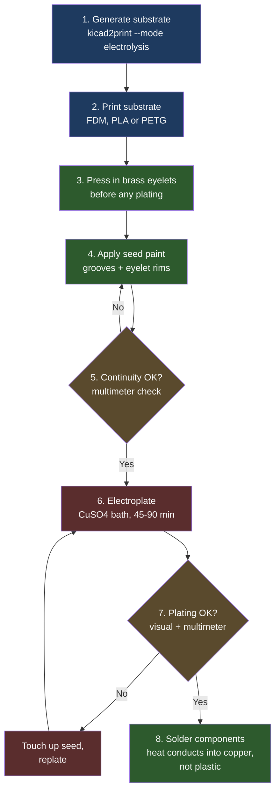
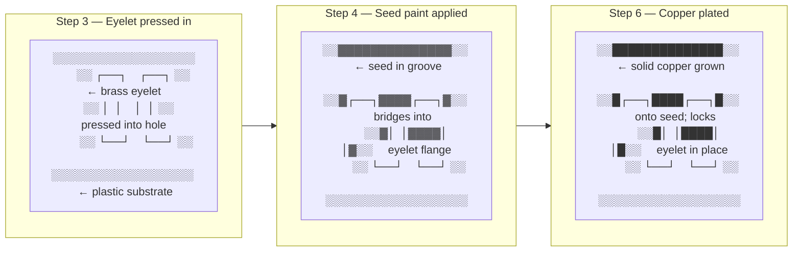
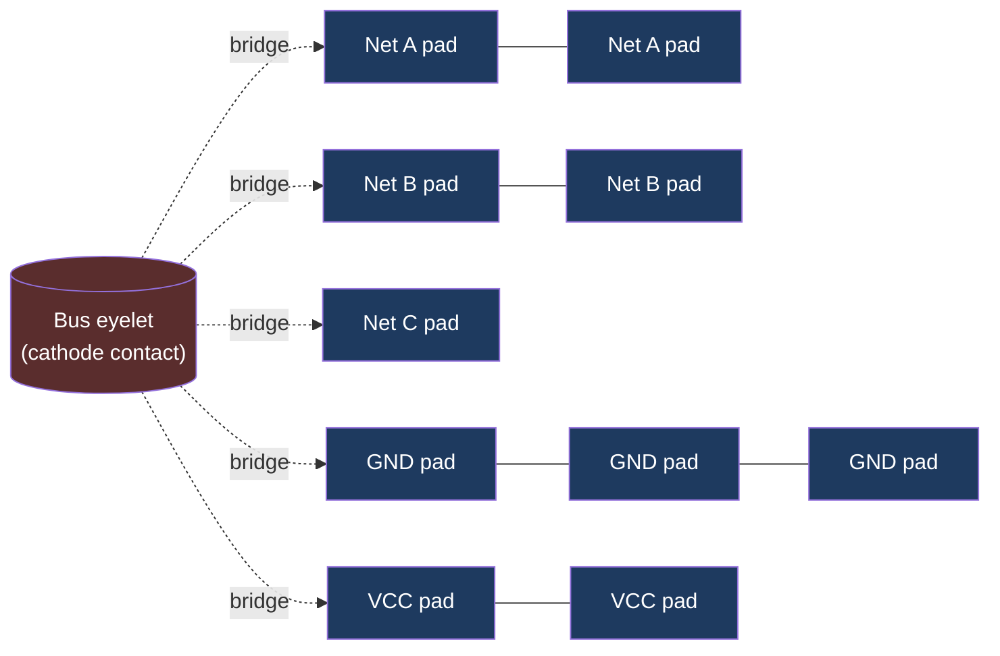
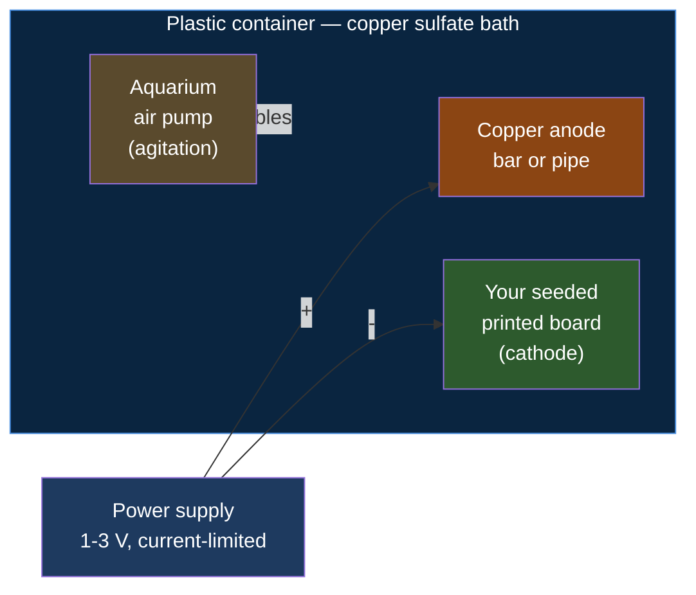

# Electrolysis (Copper Electroplating) Build Guide

This guide covers the full end-to-end process for building a hybrid PCB using kicad2print's electrolysis mode: from generating the substrate, through seeding and plating, to installing eyelets and soldering components.

The result is a board with **real copper traces electroplated into the printed grooves** — mechanically robust, solderable like a normal PCB, and without the wire-handling work of the copper-wire mode.

> **Safety first.** This process uses dilute sulfuric acid and copper sulfate. Both are hazardous. Read the [Safety](#safety) section before starting. Wear gloves and eye protection. Keep chemicals away from children and pets.

---

## Why electroplating?

The copper-wire mode works, but it has two persistent pain points:

1. **Soldering eyelets to wire traces deforms the substrate.** The thermal mass of the iron tip + eyelet on a thin plastic substrate is enough to soften PLA or PETG and pull the eyelet out of alignment.
2. **Wire handling is tedious for boards with many short traces** or fine pitch.

Electroplating sidesteps both: the eyelet is pressed into the substrate *before* plating, gets coated with the same conductive seed, and is then locked in place by the plated copper that grows around its flange. The eyelet becomes part of the copper layer — there is no separate solder joint between trace and eyelet to fail.

For larger nuance and the conversation that led to this guide, see the design notes at the end.

---

## Process overview



Steps 1–2 are software/printer; steps 3–7 are the wet workflow; step 8 is normal assembly.

> ### ⚠ The most important design rule: every net must reach the cathode
>
> The plating bath only deposits copper on surfaces that the cathode current can reach. In a normal PCB, **every net is deliberately isolated from every other net** — that's the whole point of routing. For plating, that isolation has to be temporarily broken: **every net must be connected, via a sacrificial bridge, to a common cathode contact point.** After plating, those bridges are cut to restore the intended isolation.
>
> Concretely, this means your printed substrate needs:
>
> 1. **One cathode-contact point** — typically a bus eyelet or pad at the board edge where you clip the power supply lead.
> 2. **Sacrificial bridge traces** — thin grooves from the bus point out to **at least one pad on every net**. These get plated along with everything else.
> 3. **A plan for cutting the bridges afterwards** — typically a sharp hobby knife or Dremel cut-off wheel at marked break points.
>
> If you forget a bridge on even one net, that entire net will not plate — you'll have copper everywhere except on the one trace you forgot, and you won't notice until you do the post-plating continuity check.
>
> This is currently a **manual KiCad design step**: add the bridges as regular traces on a sacrificial "plating bus" net before running kicad2print, then cut them physically after plating. A future kicad2print feature could auto-generate these — see [Open improvements](#open-improvements) below.

### What's happening physically



The key insight: by step 6 the eyelet is mechanically and electrically *part of the copper layer*, not glued or soldered to it. There is no joint between trace and eyelet to fail later.

---

## Step 1 — Generate the substrate

Use the electrolysis preset:

```bash
kicad2print my_board.kicad_pcb --mode electrolysis
```

Or copy `presets/electrolysis.toml` and edit it:

```bash
cp presets/electrolysis.toml kicad2print.toml
# edit channel_width_mm, eyelet_diameter_mm, etc. as needed
kicad2print my_board.kicad_pcb --config kicad2print.toml
```

### Settings that matter for plating

| Setting | Default | Why it matters for plating |
|---|---|---|
| `channel_width_mm` | `0.7` | Defines the **trace width**. Plated copper fills the groove. 0.3–0.5 mm for signal traces, 0.7–1.0 mm for power. |
| `channel_depth_mm` | `0.5` | Deeper grooves survive the seed sanding step (if you choose to sand) and hold more copper. Don't go below 0.4 mm. |
| `eyelet_style` | `hole` | Must be `hole`, not `indent` — eyelets press into actual through-holes and get plated in place. |
| `eyelet_diameter_mm` | `1.5` | Sized for press-fit of your eyelet. Measure your eyelets and match. |
| `substrate_thickness_mm` | `3.0` | Slightly thicker than wire mode — gives rigidity during the bath. |

The generated `boardname_guide.html` includes a continuity-test tab that's especially valuable for plating: you'll use it at steps 5 and 7 to verify every net.

---

## Step 2 — Print the substrate

- **Material:** PETG preferred (Tg ~80°C — survives nearby soldering better). PLA works but is more heat-sensitive at the soldering step.
- **Layer height:** 0.1 mm for fine grooves (≤ 0.5 mm), 0.2 mm otherwise.
- **Infill:** 60% or more — the board needs to resist warping in the bath.
- **Orientation:** flat, board face up. Grooves should be on the top surface.
- **First layer:** clean and well-tuned — the bottom of through-holes needs to be open so eyelets seat fully.

After printing, clean the board with isopropyl alcohol and let it dry completely. Skin oils prevent seed paint from adhering.

---

## Step 3 — Press in the eyelets

Use **brass eyelets** sized to your `eyelet_diameter_mm`. Common sources:

- Leather/scrapbooking suppliers (Tandy Leather, eyelet kits on Amazon)
- Jewelry-making suppliers
- Hardware stores (often sold as "grommets" for small sizes)

**Avoid:**
- Aluminum — does not plate well in a copper bath
- Steel — needs a nickel strike first
- Plated steel — plating layer interferes with bonding

Press each eyelet into its through-hole until the flange sits flush on the top surface. A simple eyelet setter (or even a flat-faced punch and a hammer with a soft backer underneath) works. The eyelet should be a firm friction fit — if it falls out, the hole is too large; if it won't seat, the hole is too small.

### The plating bus and sacrificial bridges

As called out in the [design rule above](#-the-most-important-design-rule-every-net-must-reach-the-cathode), every net needs a path to a single cathode-contact point. The standard way to do this:

- **Pick one location** on the board edge for the cathode clip — a bus eyelet works well, or a wide pad.
- **In KiCad, before generating the substrate**, draw thin "bridge" traces from this bus point to **one pad on every net**. Treat them as part of the design.
- **Mark each bridge** at a convenient cut point — a notch in the design, or just a mental "I'll cut here". After plating, you'll physically cut each bridge to restore net isolation.



Dotted lines are the sacrificial bridges — present during plating, cut afterwards. Solid lines are the actual signal/power routing from your design.

**Practical tips:**

- **One bridge per net is enough** — once any pad on the net is connected, copper spreads to the rest of the net through the trace itself.
- **Make bridges as thin as the printer can reliably do** (~0.3 mm) — they're easier to cut and use less copper.
- **Route bridges to the nearest pad** on each net to minimize length.
- **Group bridges along one or two board edges** so cutting them after plating is one or two clean operations rather than scattered surgery.
- **GND is often already connected** to many points through the design — you typically only need a single GND bridge.

---

## Step 4 — Apply seed paint

The seed has one job: provide **continuous low-resistance conductivity from the cathode contact across every trace and into every eyelet** so the plating bath can deposit copper everywhere simultaneously. Once copper starts depositing, the copper itself becomes the conductor and the seed is irrelevant — so the seed need not be a great conductor, only a continuous one.

### Recommended seed materials

Ranked by cost/effort balance for hobbyist use:

| Seed | Cost | Adhesion | Conductivity | Notes |
|---|---|---|---|---|
| **Guitar shielding paint** | ~$13 / 50 g | Excellent | Good | Brush-on, designed for continuous conductivity. Best value. |
| **Bare Conductive paint** | ~$10 / 10 g | Good | OK | Carbon-based, brushable, designed for this kind of use. |
| **MG Chemicals Super Shield nickel spray** (843AR / 838AR) | ~$30 / can | Excellent | Excellent | Spray-and-sand workflow. Most reliable for spray. |
| **Defroster repair paint** (Permatex, MG 8331D) | ~$10–25 | Good | Excellent | Silver-loaded despite the "copper" name on some products. Overkill but works. |
| **Graphite dry lubricant spray** (CRC, etc.) | ~$8 / can | Weak | OK | Cheapest spray option. Tack-coat with clear lacquer first to improve adhesion. |
| **DIY graphite + nail polish** | <$5 | OK | OK | Crushed pencil lead or graphite powder mixed with clear nail polish, thinned with acetone. Canonical electroplating seed. |

For a first attempt, **guitar shielding paint** is the sweet spot: brushable, sticks to PLA/PETG without a primer, and 50 g is enough for many boards.

### Application

**Brush-on (recommended for most boards):**

1. Stir the paint thoroughly — conductive particles settle.
2. With a fine brush, paint every groove. Make sure the paint **fully bridges from the trace into the eyelet flange** — gaps here will become breaks in the plated copper.
3. Paint over the eyelet flange too; don't try to keep it clean. The eyelet should be electrically continuous with its trace via the seed before the bath.
4. Two coats is normal. Let each cure fully (check the product's datasheet — typically 1–24 hours).

**Spray-and-sand (alternative — clean look, good for many short traces):**

1. Mask any areas you don't want coated (or skip masking and rely on the sanding step).
2. Spray two even coats over the entire top surface. Let cure.
3. Wet-sand the flat top surface with 600-grit, sanding **parallel to the longest trace direction**. The high surface becomes bare plastic; the recessed grooves remain coated. This is the "damascene" pattern real chip fabs use.
4. Check with a multimeter that adjacent traces are **not** shorted to each other (sanding can smear conductive material across the surface).

### Verify continuity (step 5 is really part of this step)

Before going anywhere near the bath, open `boardname_guide.html` and switch to the continuity tab. You're checking **three** things:

**1. Continuity within each net** — pads on the same net should be electrically connected through the seed.
- Probe one pad, then probe every other pad the guide highlights for that net.
- Expect low resistance: under a few kΩ for a graphite seed, under 100 Ω for a metallic seed.

**2. Isolation between different nets** — pads on different nets should *not* be connected (except via the bridges, see below).
- Probe a pad on net A, then a pad on net B (that isn't on the same bridge path).
- Expect open circuit or > 1 MΩ.

**3. Every net reaches the cathode bus** — this is the test that catches a forgotten bridge before you waste a plating run.
- Probe the bus eyelet, then probe one pad on every single net in the design.
- Every net should show continuity to the bus. **If any net shows open circuit to the bus, that net will not plate.** Add a bridge with extra seed paint (or go back to KiCad and add a proper bridge, reprint, re-seed) before continuing.

Fix any within-net breaks by touching up with more seed paint. Fix any between-net shorts (except intended bridges) by carefully scribing between the traces with a needle or fresh-blade hobby knife.

**Do not skip this step.** It is dramatically easier to find and fix continuity problems now than after plating.

---

## Step 6 — Electroplating

<p align="center">
  
  <br/>
  <em>The basic plating circuit. Image by Torsten Henning, public domain, via <a href="https://commons.wikimedia.org/wiki/File:Copper_electroplating.svg">Wikimedia Commons</a>.</em>
</p>

Your printed board takes the place of the cathode (the spoon in the diagram). Copper dissolves from the anode bar into the bath as Cu²⁺ ions and deposits onto every conductive surface connected to the cathode lead.

### Bath chemistry (acid copper plating)

<p align="center">
  
  <br/>
  <em>Copper sulfate pentahydrate — what you'll be mixing into the bath. Photo by W. Oelen, <a href="https://creativecommons.org/licenses/by-sa/3.0/">CC BY-SA 3.0</a>, via <a href="https://commons.wikimedia.org/wiki/File:Copper_sulfate_pentahydrate_crystals.jpg">Wikimedia Commons</a>.</em>
</p>


| Ingredient | Amount per liter of water | Source |
|---|---|---|
| Copper sulfate pentahydrate (CuSO₄·5H₂O) | ~200 g | Hardware store: **Roebic** or **Zep** root killer (label must read 99%+ copper sulfate, nothing else). Or pool-supply "copper sulfate crystals". Or Amazon: "copper sulfate pentahydrate 99%". |
| Sulfuric acid (H₂SO₄) | ~50 g (≈ 30 mL of 35% battery acid) | Auto parts store: **battery acid** / **battery electrolyte** (already pre-diluted to ~35%). Strongly preferred over drain-cleaner sulfuric, which has additives. |
| Distilled water | 1 L | Grocery store. Tap water has minerals that contaminate the bath. |
| Salt or HCl (chloride source) | A pinch / a few drops | Improves deposit quality. Optional but recommended. |
| Brightener additive | Per product instructions | Optional. Makes plating smooth and shiny rather than matte. Caswell, Eastwood, or generic. |

**Don't want to mix your own?** Caswell Plating and Eastwood sell pre-mixed acid copper kits for ~$40–50 that include bath, brightener, and instructions. Lowest-friction starting point.

**No-acid alternative:** copper sulfate + white vinegar + table salt gives a slower, lower-current bath that still works for thin plating. Useful if sulfuric acid is restricted in your area (EU/UK explosive-precursor regulations).

### Equipment

- **Plastic container** large enough to fully submerge the board with room around it. The bath is acidic — no metal containers.
- **Copper anode**: pure copper bar or pipe from the plumbing aisle. **Phosphorized copper** anodes (from a plating supplier) produce less sludge but plain copper works.
- **Power supply**: bench supply ideal, but a USB phone charger through a current-limiting resistor works in a pinch. You need **1–3 V** and the ability to control **~10–20 mA per cm² of trace area**.
- **Cathode clip**: alligator clip on insulated wire, attached to your bus eyelet (or any single eyelet that's continuous with everything else).
- **Agitation**: cheap aquarium air pump bubbling in the bath, or a magnetic stirrer. Strongly recommended — agitation is the single biggest factor in plating quality.

### Bench setup at a glance



Anode and board hang parallel about 5 cm apart, both fully submerged. The air pump bubbling underneath keeps fresh electrolyte against the board surface — this single addition makes the biggest difference to plating quality.

### Procedure

1. **Clean the seeded board** with isopropyl alcohol. Don't touch the surface with bare fingers afterward.
2. **Mix the bath** (or use the pre-mixed kit) in the plastic container.
3. **Suspend the anode** in the bath, parallel to where the board will sit, about 5 cm away.
4. **Connect the power supply:** anode to **+**, board's bus eyelet to **−**.
5. **Immerse the board** so all traces are submerged. Confirm it does not touch the anode.
6. **Low current first** (≈ 5 mA/cm² of total trace area) for the first 5 minutes. This is the critical phase: copper has to bridge the resistive seed before you can ramp current. If you slam full current onto a high-resistance seed, the seed burns out and plating fails near the cathode clip while the far end stays bare.
7. **Ramp to bulk current** (10–20 mA/cm²) for the rest of the run.
8. **Run time:** ~25 microns of copper per hour at 10 mA/cm². For solderable traces, aim for 25–50 microns thickness, so plan **45–90 minutes** of plating time.
9. **Rinse with distilled water** when done. Dry with compressed air or pat dry with a lint-free cloth.

### Visual cues during plating

| What you see | What it means | What to do |
|---|---|---|
| Salmon-pink, matte, even copper across all traces | Good plating | Keep going |
| Dark brown/black, powdery deposit | "Burnt" plating — current too high | Lower current immediately |
| Copper only near the cathode clip, far end still bare | Seed too resistive for current level | Lower current to <5 mA/cm², wait — copper will slowly bridge |
| Bright shiny copper | Brightener is working | Good |
| Bubbles streaming from the cathode | Current too high — water is electrolyzing instead of plating copper | Lower voltage/current |

### Reusing and maintaining the bath

The bath is **reusable indefinitely** with basic care — this is one of the main advantages of acid copper plating. The chemistry self-replenishes: copper leaves the anode as Cu²⁺ and deposits on the cathode, so total copper in solution stays roughly constant. Sulfuric acid isn't consumed at all.

**What to top up:**

- **Distilled water** — evaporation slowly lowers the level over weeks/months. Top up to the original line.
- **Anode** — the copper bar gradually dissolves. Swap when it gets thin or heavily pitted. A 6 mm bar lasts dozens of boards.
- **Brightener** (if used) — gets consumed and breaks down. Top up per the product instructions, typically every few hours of plating time.

**Storage between sessions:**

- Sealed plastic container with a tight lid (the bath is hygroscopic).
- Clearly labeled: **"COPPER SULFATE / SULFURIC ACID — CORROSIVE — DO NOT DRINK"**. The blue color looks like a sports drink. Lock away from children and pets.
- Room temperature. Don't freeze — copper sulfate will crystallize out.
- Anode can stay in or be removed; both work.

**Common bath problems:**

| Problem | Cause | Fix |
|---|---|---|
| Muddy sludge at the bottom | Non-phosphorized anode shedding particles | Filter through a coffee filter; switch to phosphorized copper anode |
| Rough/dull deposits over time | Brightener depleted or chloride drifted low | Top up brightener; add a few drops of dilute HCl or a pinch of salt |
| Crystals forming in the bath | Evaporation concentrated it | Add distilled water until crystals redissolve |
| Cloudy white precipitate after cold storage | Sulfate dropped out of solution | Warm gently in a sealed container in a warm water bath |
| Pale or yellow-green tint | Iron or organic contamination | Filter; "dummy plate" overnight at low current onto a sacrificial cathode to clean up |

**Practical lifetime:** for hobby use (a few boards a month), the bath lasts **years** with occasional brightener top-ups. People who do electroforming jewelry use the same bath for a decade.

**When to actually replace it:**

- Visible organic contamination that won't filter out (oils, dissolved glue, etc.)
- After a major spill where you've had to dilute heavily with water
- After accidentally adding the wrong chemical

### Step 7 — Verify the plated board

Same continuity test as step 5, but now you should see:

- Near-zero resistance (< 1 Ω) across pads on the same net
- Open circuit between pads on different nets
- Visible copper filling every groove and around every eyelet flange

If a net shows higher than expected resistance, look for places where the seed didn't bridge to the eyelet — those spots will be bare or thin. You can fix small breaks by touching up with seed and running the bath again briefly.

---

### Cut the sacrificial bridges

Before soldering components, **cut every plating bridge** to restore the net isolation your design needs. A sharp hobby knife works for thin bridges; a Dremel cut-off wheel is faster for many bridges. After cutting, re-run the continuity check from step 7 — now you should see:

- Continuity within each net (still good)
- **Open circuit between different nets** (now correct, where before it was shorted via the bridges)
- The bus eyelet should now be electrically isolated from any net (or only connected to a single net if you chose to leave one bridge intact for grounding).

If a bridge cut didn't fully sever the copper, you'll still see continuity between two nets — find the bridge and cut deeper.

## Step 8 — Solder components

Because the eyelets are now mechanically locked into a plated copper layer, soldering behaves like a normal PCB:

- Heat conducts into the copper, not directly into the plastic.
- The eyelet provides thermal mass that delays heat transfer to the substrate.
- Standard 60/40 or lead-free solder works.

**Tips:**

- **Pre-tin the eyelet** if you find solder is balling up — the plated copper accepts solder cleanly once tinned.
- **Use a chisel tip** for fast heat transfer (less dwell time = less heat into plastic).
- **Low-temp solder** (Sn42/Bi58, melts at 138°C) is a good safety margin if you're using PLA.

---

## Safety

This is the part to read in full before mixing anything.

### Chemicals

- **Sulfuric acid (battery-strength, 35%)** causes severe burns. Wear nitrile gloves and chemical splash goggles. Keep baking soda nearby to neutralize spills. Rinse skin contact with copious water immediately.
- **Copper sulfate** is bright blue and toxic if ingested. It looks like a drink mix. **Lock it up if children or pets are in the house.** Wear gloves when handling powder — dust can irritate skin and eyes.
- **Always add acid to water**, never water to acid. (The reverse can flash-boil and splash acid.)

### Electrical

- Plating voltage is low (1–3 V), but a faulty power supply or wet bench is still a shock risk. Keep the bath on a non-conductive surface, away from the power supply.
- Do not let exposed wire from the power supply touch the bath.

### Ventilation

- Plating generates a tiny amount of hydrogen at the cathode and oxygen at the anode. At hobby scale this is harmless in a normally-ventilated room. Don't plate in a sealed closet.

### Disposal

- **Never pour spent bath down the drain.** Copper sulfate is toxic to aquatic life and to municipal sewage biology.
- **Disposal is rare in practice** — see [Reusing and maintaining the bath](#reusing-and-maintaining-the-bath). The chemistry self-replenishes and properly stored baths last years to a decade. Most hobbyists never need to dispose of a bath.
- When you *do* need to dispose: store in a labeled, sealed plastic container and take to a hazardous waste collection day. Many auto parts stores and hardware stores accept used battery acid.

### PPE checklist

- Nitrile gloves
- Chemical splash goggles (not just safety glasses)
- Long sleeves and closed-toe shoes
- Baking soda within arm's reach
- Distilled water rinse bottle within arm's reach

---

## Troubleshooting

| Symptom | Likely cause | Fix |
|---|---|---|
| Plating only happens near the cathode clip | Seed resistance too high for selected current | Lower current to a few mA/cm² and wait; copper will bridge |
| No plating anywhere | No electrical connection from cathode to seed | Check cathode clip, check continuity from clip to a far trace with multimeter |
| Burnt / black powdery deposit | Current density too high | Reduce current; increase agitation |
| Plating peels off | Seed adhesion poor, or surface contaminated | Clean with IPA before seeding; use a seed designed for plastic |
| Plating bridges across the surface between traces | Seed paint smeared on the flat surface | Scribe the bridge with a needle; for spray seeds, sand harder next time |
| Eyelet wobbles after plating | Press-fit was loose, plating didn't bridge into the hole | Reseed and replate, or set the eyelet with epoxy and seed/replate around it |
| Substrate warped from bath | Substrate too thin, or too long in the bath | Increase `substrate_thickness_mm`; consider PETG over PLA |

---

## Design notes

A few things worth knowing for advanced use:

### When NOT to use electrolysis mode

- **One-off small boards (under ~10 traces)** — the wire mode is faster to assemble than mixing a bath.
- **Edge connectors or sliding contacts** — plated copper is soft and wears through quickly under friction (real PCBs use nickel + gold for this reason). Plate, then add a nickel layer on top, *or* solder a real FR4 edge connector to the plated board and let the FR4 do the friction work.

### Nickel topcoat for durability

After copper plating, swap to a nickel sulfamate or Watts nickel bath and plate ~5–10 microns of nickel on top. Nickel is much harder than copper and resists oxidation. This is what brings plated boards close to commercial PCB durability for connectors, contacts, and exposed pads.

### Seeding only the grooves vs. the whole surface

Two viable styles:

- **Brush seed only into grooves and onto eyelet flanges** — cleaner, no sanding step, lower seed material usage. Recommended for most projects.
- **Spray seed over the whole surface, then sand the flat areas off** — easier to apply (no precision brushwork), trace edges come out crisp because the groove walls protect the seed. Recommended if you have many fine traces and don't mind the sanding step.

### Why eyelets go in before plating, not after

If you install eyelets after plating, you have to make a separate electrical connection between each eyelet and its trace — which means soldering or conductive adhesive on top of the already-plated trace. This recreates the exact thermal-damage problem this whole approach is meant to avoid. Installing eyelets before plating means the plating step itself creates the electrical and mechanical bond.

---

## Going further

- **Hackaday's electroplating-as-PCB articles** are the canonical hobbyist references — search "Hackaday 3D printed PCB electroplating" for active project writeups.
- **Caswell Plating's electroforming guide** covers the chemistry in much more detail than this document.
- For larger production runs, look into commercial electroless copper plating kits — they coat plastic without needing a conductive seed, at the cost of more complex chemistry.

---

## Open improvements

Things this guide identifies as manual steps today that could become tooling:

- **Auto-generate plating bridges in kicad2print.** A `--plating-bus <edge>` flag could detect every net, route a thin sacrificial bridge from each net's nearest pad to a bus rail along the specified board edge, and add visible cut markers in the substrate model. This would make the "every net must reach the cathode" rule a property of the generator instead of a design discipline the user has to remember.
- **Bridge cut markers in the unified guide.** The continuity-test tab could highlight bridge locations and walk the user through cutting them after plating, with an explicit "bridges cut?" verification mode that flips the expected continuity for previously-bridged net pairs from "connected" to "isolated".
- **Plating bus continuity check before bath.** A guide mode that explicitly walks every net → bus, ticking off each net as verified, to catch missing bridges before any chemistry is mixed.

If you've built any of these, PRs welcome.

---

## Image credits

- **Copper electroplating principle diagram** — by Torsten Henning (User:DrTorstenHenning), multilingual additions by Perhelion. Released into the **public domain**. Source: [Wikimedia Commons](https://commons.wikimedia.org/wiki/File:Copper_electroplating.svg).
- **Copper sulfate pentahydrate crystals photo** — by W. Oelen, licensed under [CC BY-SA 3.0](https://creativecommons.org/licenses/by-sa/3.0/). Source: [Wikimedia Commons](https://commons.wikimedia.org/wiki/File:Copper_sulfate_pentahydrate_crystals.jpg).
- **Mermaid diagrams** — original to this guide, same license as the rest of the kicad2print project (AGPL-3.0).
